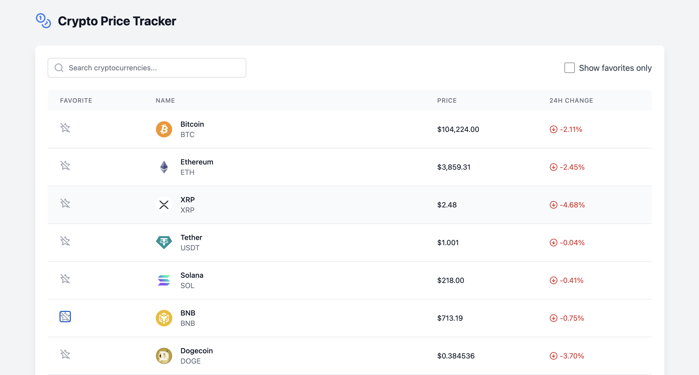
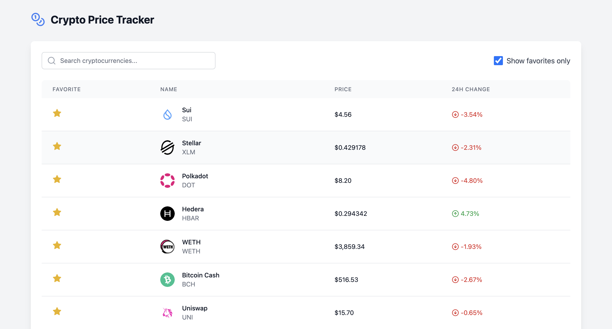
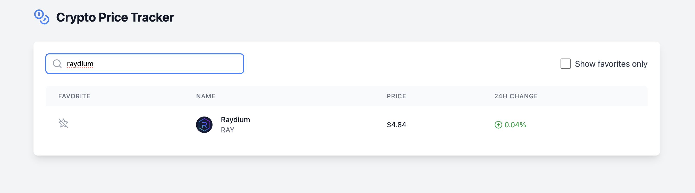

# 🚀 Crypto Tracker

A real-time cryptocurrency tracking application built with React, Node.js, and MongoDB. Monitor cryptocurrency prices, manage favorites, and stay updated with the latest market trends.

## Crypto List



## Favorites



## Search



## ✨ Features

- **Real-time Price Updates**: Live cryptocurrency price tracking
- **Favorites System**: Save and manage your preferred cryptocurrencies
- **Smart Search**: Quick and efficient cryptocurrency search functionality
- **Responsive Design**: Seamless experience across all devices
- **Price Analytics**: Track 24-hour price changes
- **Persistent Storage**: MongoDB-backed user preferences
- **Secure API**: Rate-limited and protected endpoints

## 🛠️ Technology Stack

### Frontend

- React 18 with TypeScript
- Tailwind CSS for styling
- Vite for development and building
- Lucide React for icons
- Axios for API requests

### Backend

- Node.js with Express
- MongoDB with Mongoose
- TypeScript
- Rate limiting and security middleware

## 📋 Prerequisites

- Node.js (v18 or higher)
- MongoDB (v6.0 or higher)
- npm or yarn package manager
- CoinGecko API key

## 🚀 Getting Started

1. **Clone the Repository**

   ```bash
   git clone git@github.com:dev-usmanjaved/crypto-tracker.git
   cd crypto-tracker
   ```

2. **Environment Setup**

   ```bash
   # Copy the example environment file
   cp .env.example .env
   ```

   Update the following variables in `.env`:

   - `PORT`: Backend server port (default: 3000)
   - `MONGODB_URI`: MongoDB connection string
   - `COINGECKO_API_KEY`: Your CoinGecko API key

3. **Install Dependencies**

   ```bash
   # Install all dependencies
   npm install
   ```

4. **Start Development Servers**

   ```bash
   # Start the backend server
   npm run dev

   # In a new terminal, start the frontend
   npm run dev:frontend
   ```

## 📁 Project Structure

```
crypto-tracker/
├── src/                    # Frontend source
│   ├── components/         # React components
│   ├── hooks/             # Custom React hooks
│   ├── services/          # API services
│   ├── types/             # TypeScript types
│   └── utils/             # Utility functions
├── server/                 # Backend source
│   ├── config/            # Server configuration
│   ├── controllers/       # Route controllers
│   ├── models/            # Database models
│   ├── routes/            # API routes
│   └── services/          # Business logic
└── public/                # Static assets
```

## 🔌 API Endpoints

### Cryptocurrency Routes

```
GET    /api/crypto         # Get all cryptocurrencies
GET    /api/crypto/:id     # Get specific cryptocurrency
```

### Favorites Routes

```
GET    /api/favorites          # Get user favorites
POST   /api/favorites/:id      # Add to favorites
DELETE /api/favorites/:id      # Remove from favorites
GET    /api/favorites/:id/check # Check favorite status
```

## 🔒 Security Features

- Rate limiting on API endpoints
- CORS protection
- Security headers with Helmet.js
- Environment variables for sensitive data
- Input validation and sanitization

## 🔄 Environment Variables

Required environment variables:

```env
PORT=3000
NODE_ENV=development
MONGODB_URI=mongodb://localhost:27017/crypto-tracker
COINGECKO_API_KEY=your_api_key_here
```

## 🚧 Future Enhancements

- [ ] User authentication system
- [ ] Price alerts and notifications
- [ ] Advanced charting
- [ ] Multiple currency support

## 🙏 Acknowledgments

- [CoinGecko](https://www.coingecko.com/en/api) for cryptocurrency data
- [Tailwind CSS](https://tailwindcss.com) for styling
- [Lucide](https://lucide.dev) for icons
